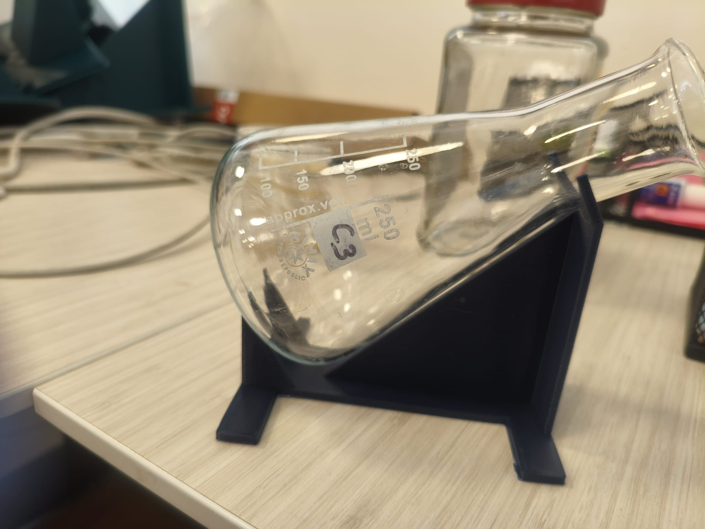
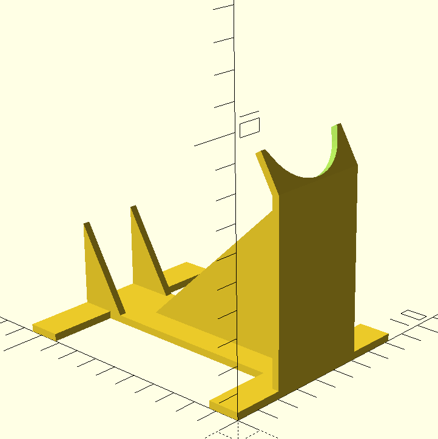
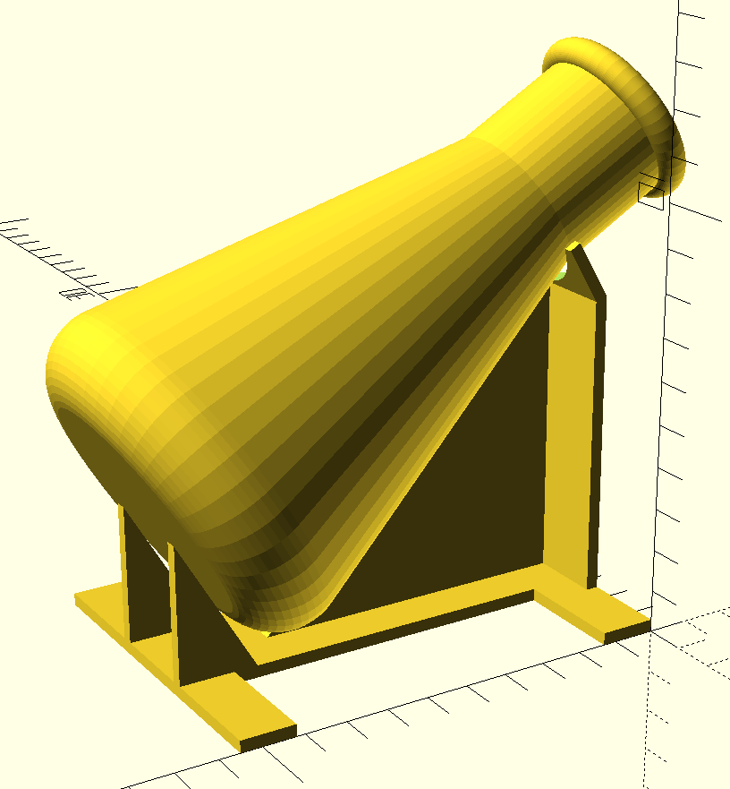
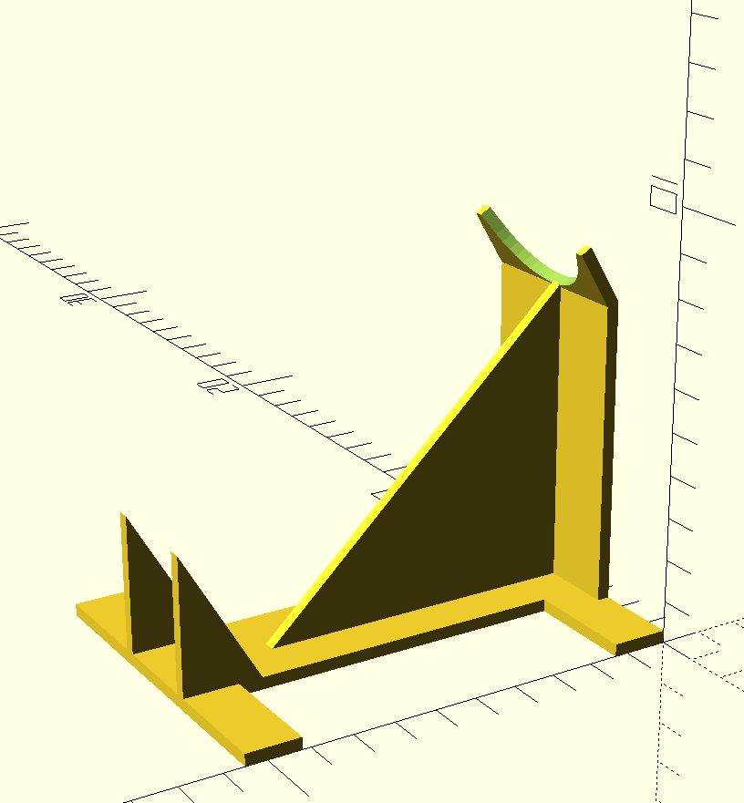

# Introduction

Accurate measurement of biomass in plant cell suspension cultures is frequently bottlenecked by methods that are either destructive, time-consuming, or prone to contamination. The CVS method offers a superior alternative—a "poor man's real-time sensor"—that transforms a standard flask into a precision measurement tool.

We provide a parametric model to democratize access to this method. Our goal is to replace ad-hoc laboratory setups with a robust, reproducible, and 3D-printable design. This approach minimizes the barrier to entry, allowing any laboratory to implement a rapid, non-destructive monitoring workflow tailored to their specific glassware inventory.

{ width=100% }

# Parametric Model Configuration

To ensure the apparatus fits the flask securely and provides accurate sedimentation angles, the model requires specific dimensions of the user's flask. These are defined in a YAML configuration file.

The required measurements are:

*   **`total_height`**: The absolute vertical height of the flask from base to the top of the rim.
*   **`neck_height`**: The length of the neck, including the rim.
*   **`base_diameter`**: The diameter of the widest part of the base.
*   **`neck_diameter`**: The diameter of the neck (measured below the rim).

The **`body_height`** (the conical section) is automatically derived as `total_height - neck_height`.

## Example Configuration (250ml Flask)

For a standard 250ml Erlenmeyer flask, the configuration would be:

```yaml
# 250ml Flask Dimensions
total_height: 13.3   # cm
neck_height: 1.0     # cm (includes rim)
base_diameter: 8.0   # cm
neck_diameter: 3.7   # cm (excludes rim)
```

{ width=45% } \ \ 
{ width=45% }

{ width=45% } \ \ 
{ width=45% }


# Principles and Benefits

The CVS apparatus holds flasks at a fixed 60-degree angle, enabling a workflow that simplifies biomass monitoring while preserving sample integrity.

## Enhanced Readability
In a flat flask, sedimented cells spread in a thin, indistinguishable layer across the wide bottom. By tilting the flask, cells are forced into the junction of the base and the wall, concentrating the biomass into a tall column. This geometric amplification translates a negligible <1 mm height difference into a clear 5–10 mm change along the angled wall, making it faster and easier to read with a standard ruler.

## Standardized Measurement
Cells, particularly those of *Theobroma cacao* (cocoa), often form aggregates that settle unevenly in vertical flasks. The 60-degree angle provides an optimal tilt—steep enough for cells to slide to maximum packing density under gravity, yet stable enough to prevent collapse. This consistency eliminates the variability of manual handling and ensures distinct, reproducible measurements.

## Non-Traumatic and Sterile Workflow
Unlike traditional sampling which requires opening the flask and breaking the sterile barrier, this method measures the flask *as is*. This results in a completely **sterile workflow** with **zero contamination risk**. Furthermore, because the sample is not removed or mechanically disturbed, the process is non-traumatic for the cells, allowing for continuous monitoring of the exact same culture throughout its growth cycle.

# Method Comparison

We compare the CVS apparatus with the traditional **Packed Cell Volume (PCV)** method, which involves centrifuging a sub-sample of the culture (typically 10-15 mL) in a 50 mL Falcon tube. While PCV provides a direct volumetric measurement, it introduces significant drawbacks regarding sterility and sample integrity.

| Feature | Packed Cell Volume (PCV) | 60° CVS Apparatus |
| :--- | :--- | :--- |
| **Contamination Risk** | **High** (Breaks sterile barrier) | **Zero** (Flask remains sealed) |
| **Sample Representativeness** | **Variable** (Sub-sample dependent) | **Complete** (Measures whole culture) |
| **Material Loss** | **Yes** (Destructive sub-sampling) | **None** (Non-destructive) |
| **Time Cost** | **High** (Pipetting, Centrifugation) | **Low** (Instant visual read) |
| **Equipment** | **Significant** (Centrifuge, tubes, tips) | **Minimal** (3D Printed Holder, Ruler) |
| **Measurement Accuracy** | **High** (For the sub-sample) | **High** (Amplified height, correlates to FW) |

# Fabrication

The models were optimized for fabrication using **Fused Deposition Modeling (FDM)** 3D printing. We utilized the **[Original Prusa MK4S](https://www.prusa3d.com/product/original-prusa-mk4s-3d-printer/)** 3D printer for its reliability and precision.

Preprocessing and slicing were performed using **[PrusaSlicer](https://www.prusa3d.com/page/prusaslicer_424/)**, which ensures optimal toolpath generation for structural integrity and print quality. The batch processing scripts provided in the repository utilize the PrusaSlicer CLI interface to automate the generation of G-code for multiple flask sizes.


# References
The apparatus described here serves as a supplementary tool to facilitate the handling of flasks described in the protocol by @mustafa2011initiation. Note that this tool is not the invention claimed in the cited patent (US Patent 5,965,438), which relates to the cryopreservation method itself.

